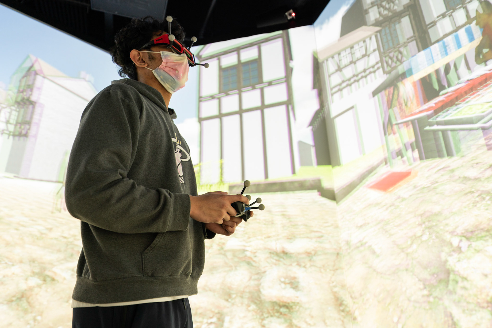
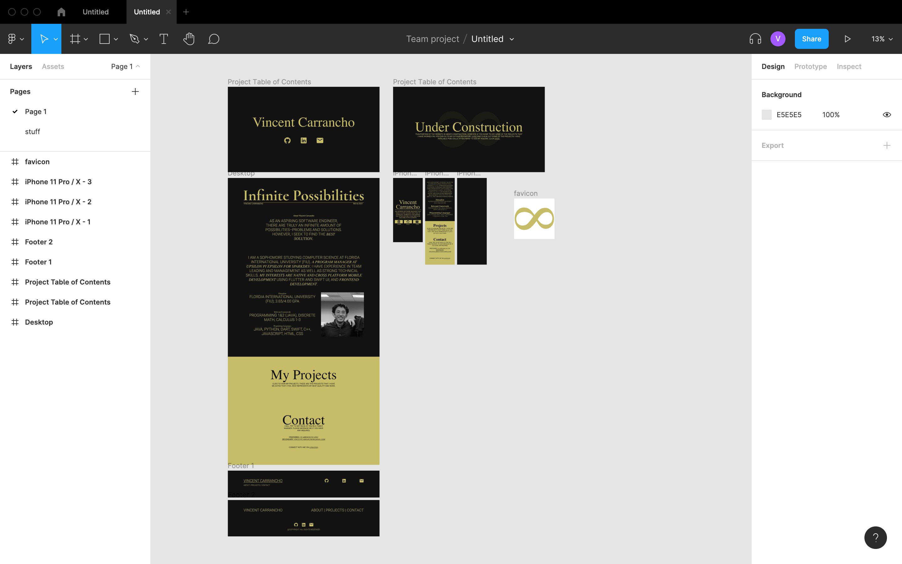

# Vincent Carrancho Personal Website

**Hello!** My name is Vincent Carrancho and I am a sophomore studying Computer Science at Florida International University! This is my personal website using Next.js and Sanity.

## Introduction

Although I am a beginner at React.js I decided to use Next.js instead of `create-react-app` just so my website could be SEO optimized (honestly, as a beginner I should not be worrying about that at all, but I just wanted to use it). Plus, the Next.js routing was more convenient to use than using react router.

## User Interface

As you can see this is a mockup that I made in Figma. It is basically only 1 single scrollable page. What is missing here is the individual projects page–which is a TBD as of January 21st–and a mobile version. But overall, I think I followed suit in the project but not perfectly–which is completely okay by my me.

## Some technical details

So as I mentioned earlier, this site was made using Next.js and Sanity. Both of which I am pretty new–especially Sanity. This website is mostly a static website but however, there is one section that I feel used React and Sanity effectively: the projects section.

Originally for the projects section, I was going to make a template of a component and pass props into the component to make it show in the UI, but I realized that this is the perfect situation to use a CMS–I then decided on using Sanity because for some reason the other CMS' that I looked into, I just could not figure out how to take an existing React project and implement their CMS, Sanity was just the easiest.

As of January 21st, I am thinking to make a mini project card section in the main page of the website, then when you click on it, it generates a whole page of that specific project. This is where I envision Next.js' dynamic routing to come in.

## I'll update you later

For now that is all I got. I'll be sure to update the readme as the project goes on.

Thank you for taking the time to read this project!
